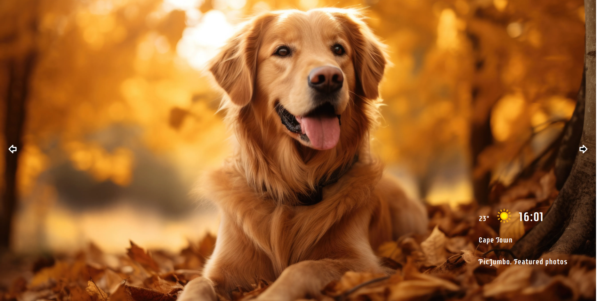

# waller-photo-slideshow

[Deployed site](https://waller-photo-slideshow.netlify.app/)

This README outlines the details of collaborating on this React+Vite application.

## Prerequisites

You will need the following things properly installed on your computer.

* [Git](https://git-scm.com/)
* [Node.js](https://nodejs.org/) (with yarn)

## Installation

* `git clone <repository-url>` this repository
* `cd waller-photo-slideshow`
* `yarn install`

## Running / Development

* `yarn dev`
* Visit your app at [http://localhost:5713](http://localhost:5713).

### Building

* `yarn build` (development)

Further Resources
-[Vitejs](https://vitejs.dev/guide/)

